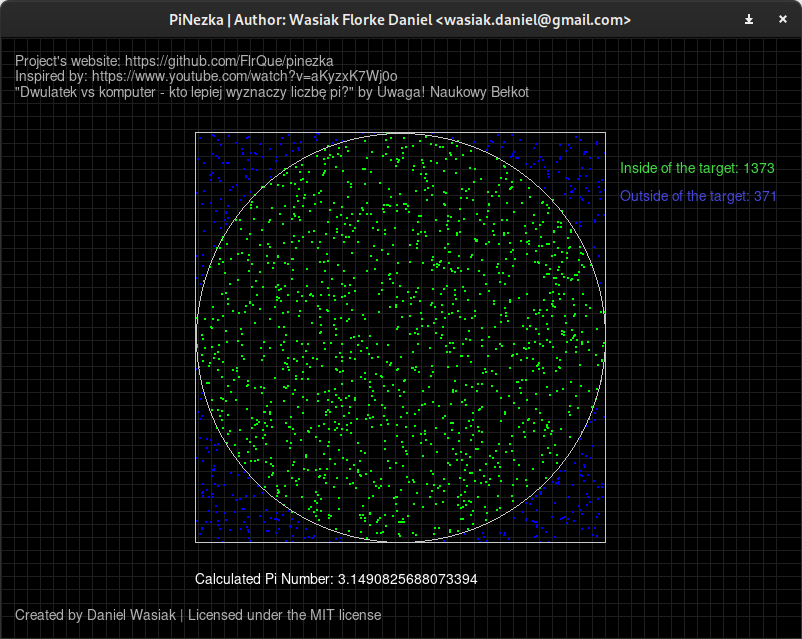

# πNezka

## About

Little project to calculate the Pi number.

Heavly inspired by the video on such topic by *Uwaga! Naukowy bełkot*

## Screenshot

## How to use?

You need pygame to run this project.

Start `app.py` and use Left/Right Mouse Buttons to shot random points to the screen.

See the calculated pi number on the bottom of the screen.

You can edit the `app.py` and change the variables like the number of shots or window side.

## Video by Uwaga! Naukowy bełkot

[Video by Uwaga! Naukowy bełkot](https://youtu.be/aKyzxK7Wj0o?t=785)
